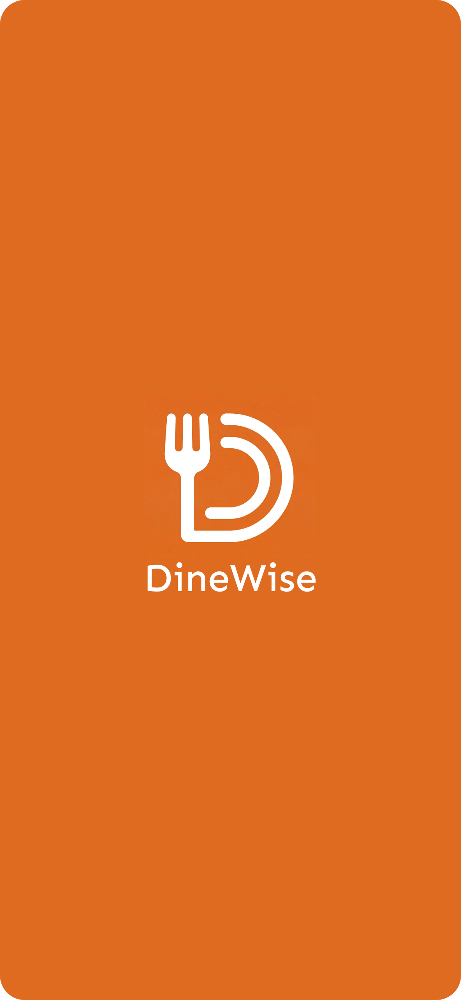
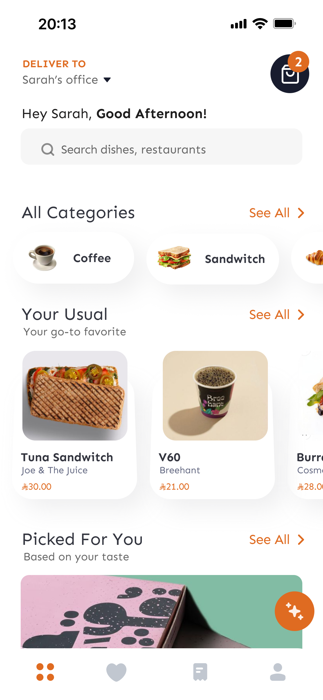
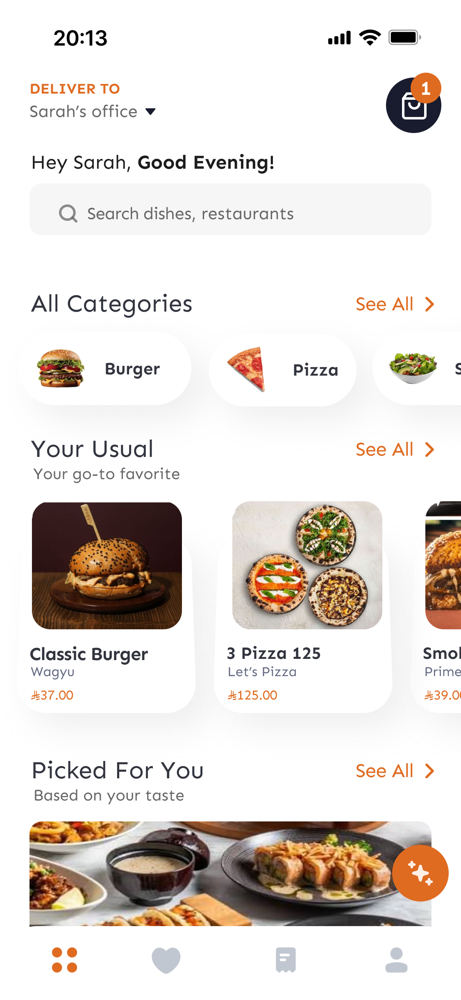
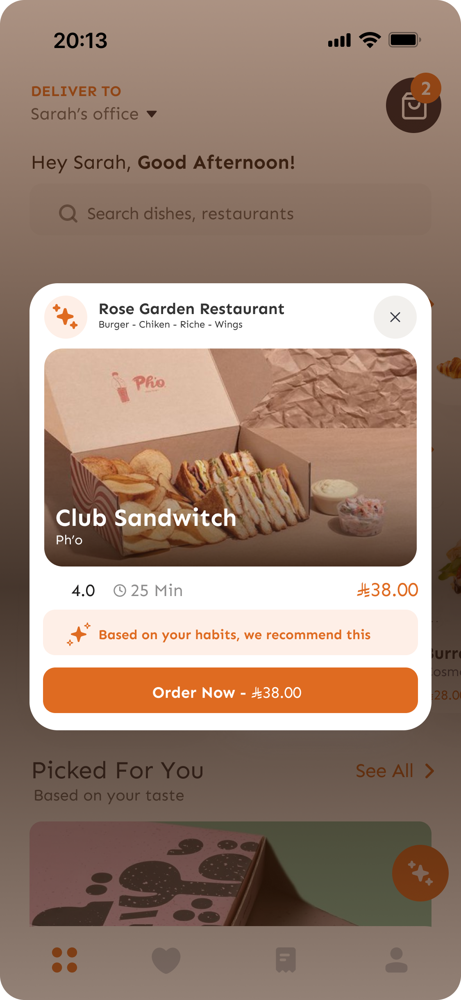
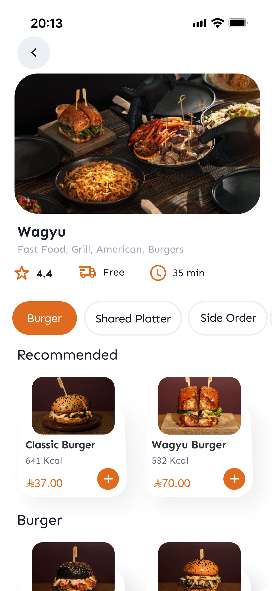

# DineWise

A UX/UI design case study proposing a personalized food delivery application that reduces decision fatigue through context-aware recommendations and user-centered design.

---

## Project Overview

DineWise is a food delivery application prototype designed to improve the user experience by providing personalized meal recommendations based on time of day and user preferences.

The project follows the Human-Computer Interaction (HCI) design process, including user research, wireframing, prototyping, usability evaluation, and accessibility improvements.

---

## Objectives

- Reduce decision fatigue during meal selection
- Provide personalized recommendations
- Improve usability and accessibility
- Design an intuitive mobile interface
- Apply Human-Computer Interaction principles

---

## Tools Used

- Figma
- User Interviews
- Usability Testing

---

## Repository Structure

```
docs/
├── DineWise_Project_Report.pdf
├── DineWise_Project_Presentation.pdf

images/
├── splash-screen.png
├── home-screen-morning.png
├── home-screen-night.png
├── smart-suggestion-popup.png
├── restaurant-page.png

---

## Documentation

Project report:

`docs/DineWise_Project_Report.pdf`

Presentation:

`docs/DineWise_Project_Presentation.pdf`

---

## Screenshots

### Splash Screen



### Morning Home Screen



### Night Home Screen



### Smart Suggestion Popup



### Restaurant Page



---

## Notes

This repository contains academic work completed as part of a Human-Computer Interaction course. Personal information has been removed before publication.
